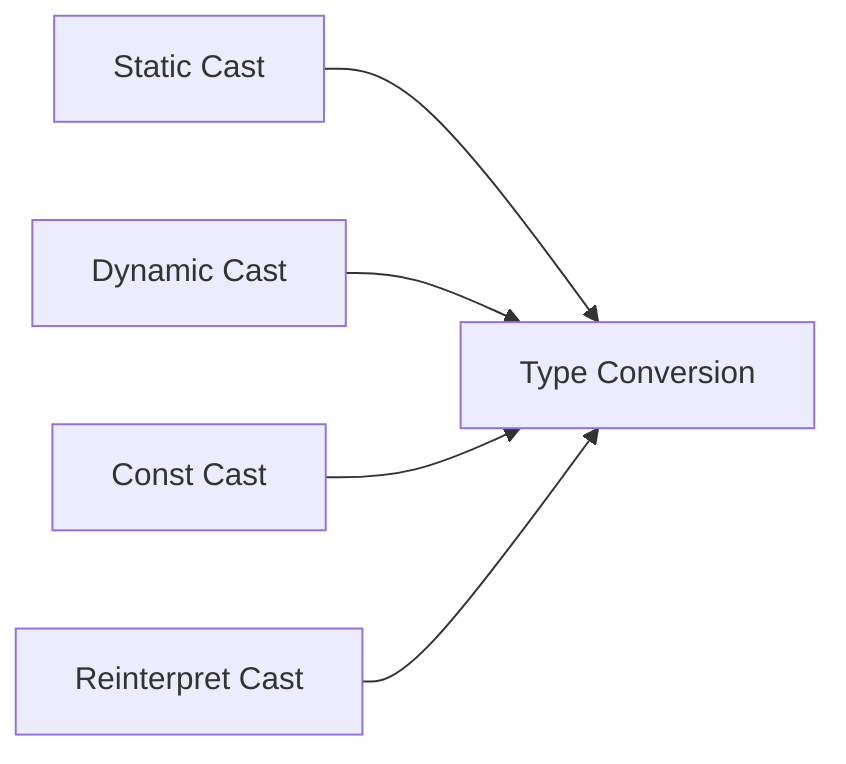

<div align="center">

# 🔷 Advanced C/C++ Programming Review


A comprehensive guide to advanced C/C++ concepts
</div>

---

<div align="center">

### 🎯 Quick Navigation

[Pointers](#1-pointers) • 
[Custom Types](#2-custom-types) • 
[Type Casting](#3-type-casting) • 
[Macros](#4-macros) • 
[Compilers](#5-compilers) • 
[Makefiles](#6-makefiles) • 
[Debuggers](#7-debuggers)

</div>

---

#### Key Concepts
- 🎯 Memory Management
- 🔄 Pointer Arithmetic
- 💫 Dynamic Allocation
- 🛡️ Smart Pointers (C++)
</details>

#### Features
- 📦 Structures
- 🔄 Unions
- 🏷️ Enumerations
- 🎨 Type Aliases
</details>

### Type Casting
<details>
<summary>View Type Casting Methods</summary>



#### Casting Types
- 🔄 Static Cast
- 🎯 Dynamic Cast
- 🛠️ Const Cast
- ⚡ Reinterpret Cast
</details>

#### Applications
- 📝 Text Substitution
- 🔍 Conditional Compilation
- 🛠️ Debug Helpers
- 📦 Header Guards
</details>

### Compilers
<details>
<summary>Learn About Compilers</summary>

| Compiler | Platform | Usage |
|----------|----------|--------|
| GCC | Cross-platform | `gcc file.c` |
| Clang | Cross-platform | `clang file.c` |
| MSVC | Windows | `cl file.cpp` |

#### Features
- 🔨 Compilation Process
- ⚙️ Optimization Levels
- 🔍 Warning Flags
- 🛠️ Debug Symbols
</details>

#### Components
- 📜 Rules
- 🎯 Targets
- 📦 Dependencies
- 🔄 Variables
</details>

#### Tools
- 🔍 GDB
- 🔎 LLDB
- 🐞 Valgrind
- 💾 Core Dumps
</details>

---

## 🌟 Optional Advanced Topics

<details>
<summary>Explore More</summary>

### Advanced Concepts
- 🧵 Multi-threading
- 🔄 Template Meta-programming
- 🎯 RAII
- 🔐 Move Semantics

### Modern C++ Features
- 🆕 Lambda Expressions
- 📦 std::variant
- 🔄 Ranges
- ⚡ Concepts
</details>

---

## 🛠️ Development Setup

<details>
<summary>Setup Instructions</summary>

### Required Tools
```bash
# Install essential tools
sudo apt install build-essential gdb cmake
```

### IDE Options
- 💻 VSCode
- 🎯 CLion
- 🔧 Eclipse
</details>

---

<div align="center">

## 📚 Learning Resources

| Resource | Description |
|----------|-------------|
| 📖 Books | "C++ Primer", "Effective C++" |
| 🎥 Videos | Online courses and tutorials |
| 💻 Practice | Coding challenges and projects |
| 🌐 Forums | Stack Overflow, Reddit r/cpp |

</div>

---

<div align="center">

### 🤝 Contributing
Feel free to submit issues and enhancement requests!

### 📜 License
This project is licensed under the MIT License - see the [LICENSE](LICENSE) file for details.

</div>
