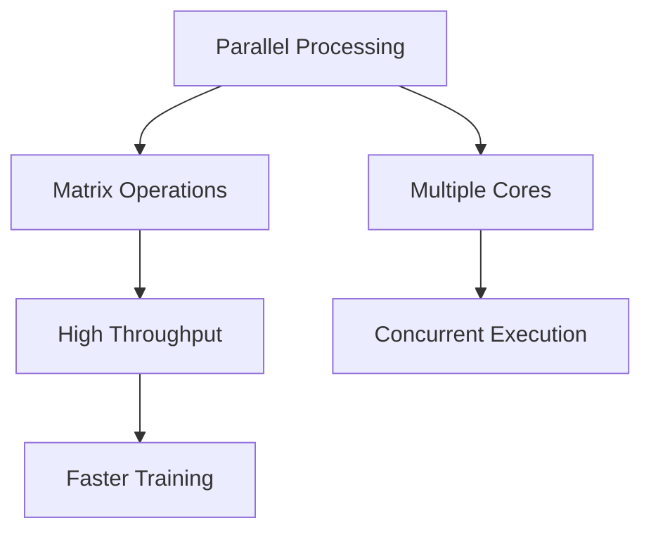
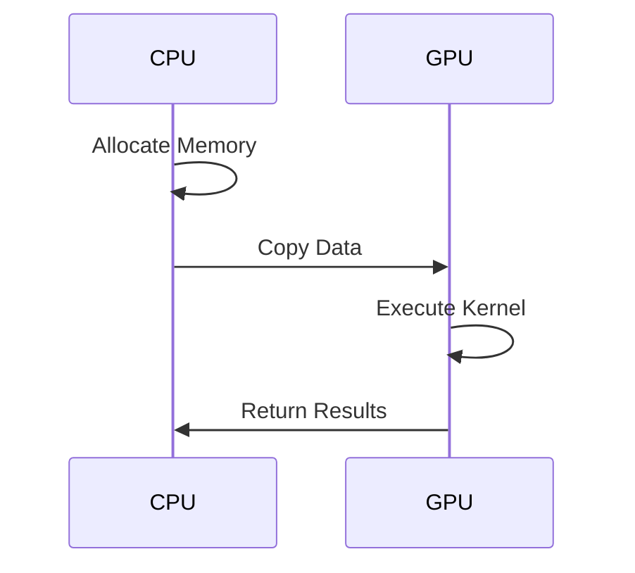
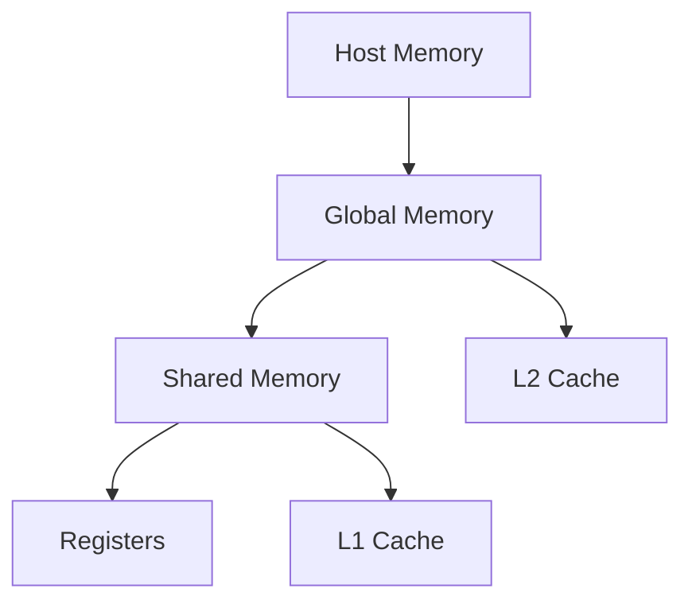

# 🚀 Advanced Guide to GPUs and Parallel Computing
> A comprehensive exploration of GPU architecture, evolution, and application in deep learning

## 📚 Table of Contents
- [Hardware Architecture](#hardware-architecture)
- [Processing Units Comparison](#processing-units-comparison)
- [NVIDIA Evolution](#nvidia-evolution)
- [Deep Learning Performance](#deep-learning-performance)
- [CUDA Programming](#cuda-programming)
- [Key Terminology](#key-terminology)

## 💻 Hardware Architecture

### Processing Units Comparison Matrix

| Feature | CPU | GPU | TPU | FPGA |
|---------|-----|-----|-----|------|
| Purpose | General | Graphics/Parallel | AI/ML | Configurable |
| Clock Speed | ⚡ High | 🔸 Medium | 🔸 Medium | 🔸 Medium |
| Cores | 🔸 Few | ⚡ Many | ⚡ Many | 📊 Variable |
| Cache | ⚡ High | 🔸 Low | 🔸 Medium | 🔸 Low |
| Latency | ⚡ Low | 🔸 High | 🔸 Medium | ⚡ Very Low |
| Throughput | 🔸 Low | ⚡ High | ⚡ High | ⚡ Very High |
| Power Usage | 🔸 Medium | 🔸 High | 🔸 Medium | ⚠️ Very High |

## 🎮 NVIDIA Evolution
> From Gaming to AI Revolution

### Timeline

## ⚡ Deep Learning Performance

### Why GPUs Excel in Deep Learning?

## 🔧 CUDA Programming Flow

## 📘 Key Terminology

### Essential Concepts
- `Kernel`: GPU-specific functions
- `Thread/Block/Grid`: Execution hierarchy
- `GEMM`: Matrix multiplication operations
- `Host/Device`: CPU/GPU terminology

### Memory Hierarchy

## 🔍 Additional Resources
- [NVIDIA Documentation](/)
- [CUDA Programming Guide](/)
- [Deep Learning Optimization](/)

## 📝 License
MIT License - Feel free to use and modify
